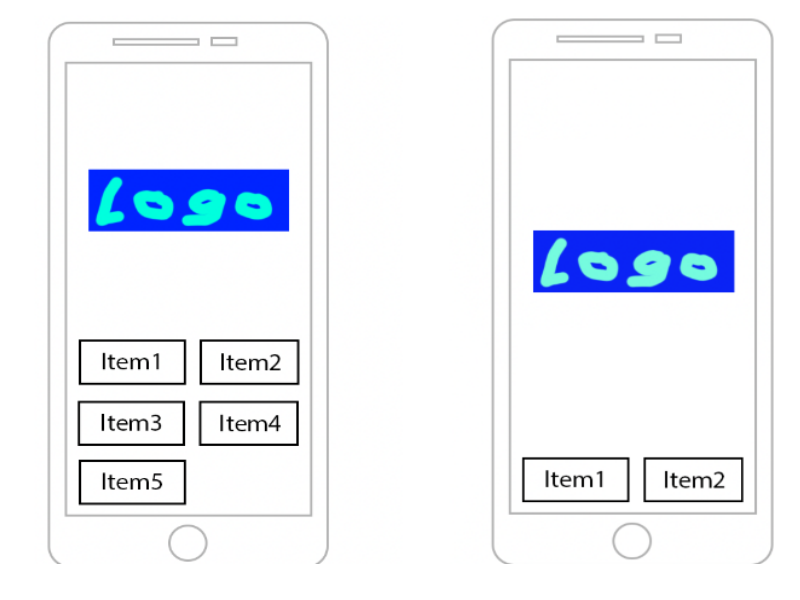
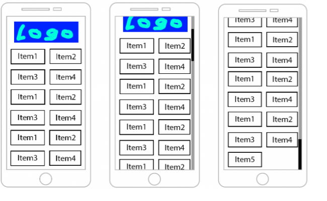
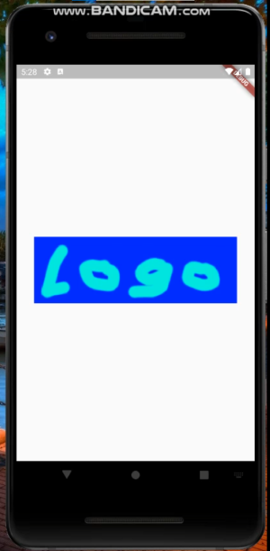

# Flutter markup test

## Task

1. Put Logo image on the screen. It’s minimal margins from each side are 30px.
2. The screen accepts List<String> items. The size of the list could be from 0 to any. This list contains the item’s names.
3. You should generate tiles with the items names. Each tile should have minimal margin 10 from each side and a black outside border. There should be two columns.
4. You should calculate tiles width and height to make it: 
    - fill the screen by width;
    - tiles aspect ratio should be 2.
5. The tiles list should be aligned to the bottom. You should use the other screen space to center Logo vertically and horizontally. See the example below.

6. If there are too many items, Logo should be aligned horizontally by it’s minimal margin and a scroll appears. See the example below.

## Result
Please click the image below to see the video

